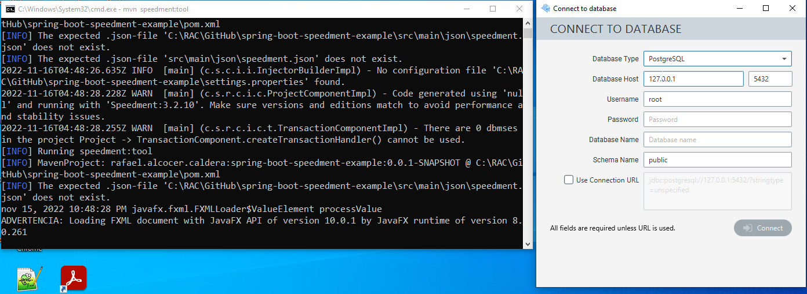
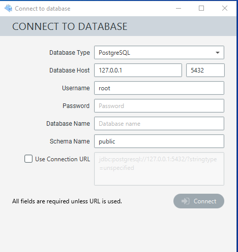
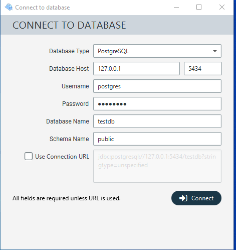
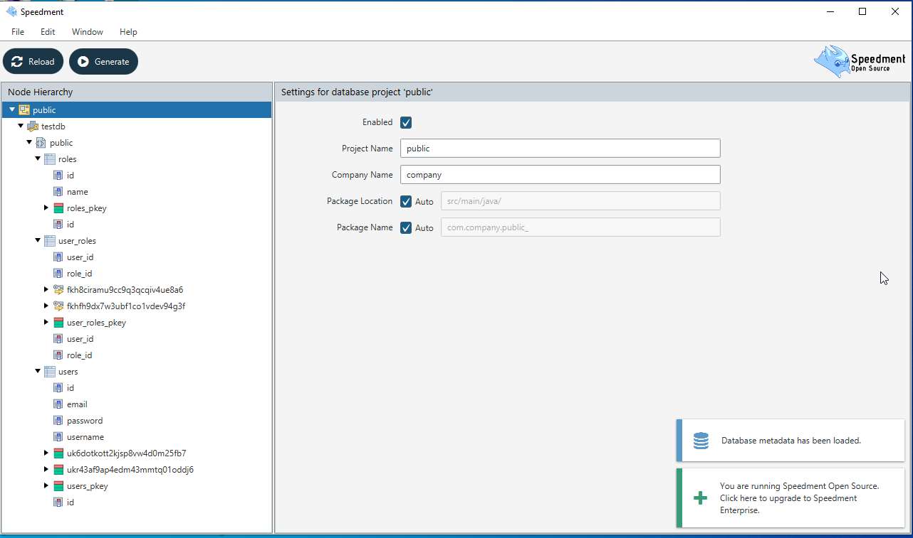
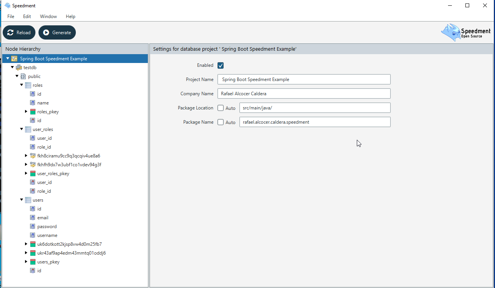
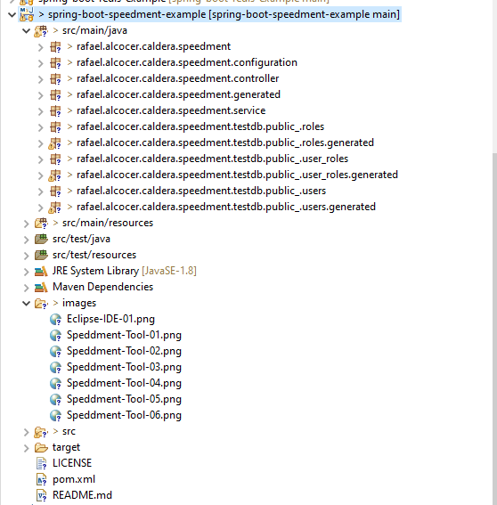
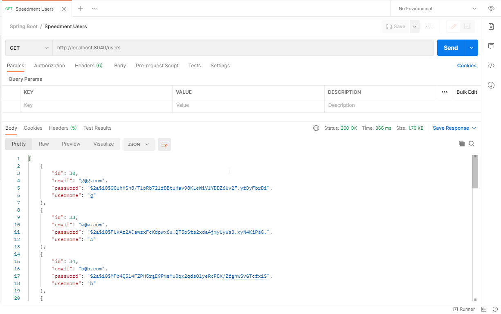

# SPRING BOOT SPEEDMENT EXAMPLE WITH POSTGRESQL

## Synopsis

The project is a Spring Boot Application with PostgresQL as a Database to test Speedment Open Source. 

## Speedment Open Source URLs

[Speedment Open Source Download](https://speedment.com/oss-download/)

[Speedment Quick Start Guide](https://speedment.com/quick-start/)

## Why Speedment Open Source?

- Speedment Open Source is the equivalent of Speedment Stream limited to use with Open Source databases. Like Stream, it analyzes the metadata of an existing SQL database and automatically creates a Java representation of the data model. Queries are then expressed as standard Java Streams instead of a sequences of SQL constructs.

- There are several license types available, of which two are free to use; Speedment Open Source and Speedment Free. Speedment Stream and Speedment HyperStream are priced depending on the number of nodes used and the required support level.

- View Database Tables as Standard Java Streams.

## Motivation

I wanted to do an authentication service.

## Pre Requirements

- You need PostgresQL installed
- You need to create the database, after this you need to execute the queries that are in the queries.sql within the resource folder
- You need the following in your pom.xml:

```code
	<properties>
		<java.version>1.8</java.version>
		<project.build.sourceEncoding>UTF-8</project.build.sourceEncoding>
		<maven.compiler.source>1.8</maven.compiler.source>
		<maven.compiler.target>1.8</maven.compiler.target>
		<speedment.version>3.2.10</speedment.version>
	</properties>

	<parent>
		<groupId>org.springframework.boot</groupId>
		<artifactId>spring-boot-starter-parent</artifactId>
		<version>2.7.5</version>
	</parent>

	<dependencies>
		<dependency>
			<groupId>org.springframework.boot</groupId>
			<artifactId>spring-boot-starter-web</artifactId>
		</dependency>
		<dependency>
			<groupId>org.projectlombok</groupId>
			<artifactId>lombok</artifactId>
		</dependency>
		<dependency>
			<groupId>org.postgresql</groupId>
			<artifactId>postgresql</artifactId>
			<scope>runtime</scope>
		</dependency>
		<dependency>
			<groupId>com.speedment</groupId>
			<artifactId>runtime</artifactId>
			<version>${speedment.version}</version>
			<type>pom</type>
		</dependency>
		<dependency>
			<groupId>org.projectlombok</groupId>
			<artifactId>lombok</artifactId>
		</dependency>
	</dependencies>

	<build>
		<plugins>
			<plugin>
				<groupId>com.speedment</groupId>
				<artifactId>speedment-maven-plugin</artifactId>
				<version>${speedment.version}</version>

				<configuration>
					<appName>${project.artifactId}</appName>
					<packageName>${project.groupId}</packageName>
				</configuration>

				<dependencies>
					<dependency>
						<groupId>org.postgresql</groupId>
						<artifactId>postgresql</artifactId>
						<version>${postgresql.version}</version>
						<scope>runtime</scope>

					</dependency>
				</dependencies>
			</plugin>
			<plugin>
				<artifactId>maven-compiler-plugin</artifactId>
			</plugin>
		</plugins>
	</build>
```

## Steps

#### Step 01

From the root of your project open a console and type:

```code
mvn speedment:tool
```



#### Step 02



#### Step 03

Put the information to connect to the database:



#### Step 04

After connecting to the database:



#### Step 05

Complete the information on the right and click Generate button:



#### Step 06

After Generate button clicked:



#### Step 07

Refresh, clean and Update Maven Project within Eclipse to see the generated classes:


#### Step 08

Classes in:
- rafael.alcocer.caldera.speedment.SpeedmentApplication
- rafael.alcocer.caldera.speedment.configuration
- rafael.alcocer.caldera.speedment.controller
- rafael.alcocer.caldera.speedment.service
Are not generated automatically.
You need to create them.

USING POSTMAN:
--------------



Request
-------
GET
http://localhost:8040/users

Response:
---------
```json
[
    {
        "id": 30,
        "email": "g@g.com",
        "password": "$2a$10$G0uhHSh8/TlpRb72lfDBtuHav98KLeWiVlYDDZ6Uv2F.yfDyFbrDi",
        "username": "g"
    },
    {
        "id": 33,
        "email": "a@a.com",
        "password": "$2a$10$FUkAz2ACawzxFcKdpwx6u.QT5pSts2xda4jmyUyWs3.xyN4KiPsG.",
        "username": "a"
    },
    {
        "id": 34,
        "email": "b@b.com",
        "password": "$2a$10$MFb4Q5l4FZPH5rgE9PmsMu0qx2qdsOlyeRcP8X/ZfghwSvGTcfx1S",
        "username": "b"
    },
    {
        "id": 36,
        "email": "c@c.com",
        "password": "$2a$10$AyUjbSylj.wn4IAdb6dM.e19XrgIcWaqp3ghFXbnPYg.x499IbnEq",
        "username": "c"
    },
    {
        "id": 40,
        "email": "d@d.com",
        "password": "$2a$10$Wk64mwGJjpUzb3oOxclnCemfJ56UAlB5WoG8Fqyq48.Dy6WhyfQgu",
        "username": "d"
    },
    {
        "id": 41,
        "email": "e@e.com",
        "password": "$2a$10$AwsBdPtqwmxgOKW6qkJmHODdlHraFslVYOxe6SxiLfdLAngihqitG",
        "username": "e"
    },
    {
        "id": 42,
        "email": "f@f.com",
        "password": "$2a$10$0SyXW60mL5Lzj4fb0c9Wm.rmK1gJ3yyPm2J8/F.DKe7qeWf1ueIHe",
        "username": "f"
    },
    {
        "id": 46,
        "email": "h@h.com",
        "password": "$2a$10$zFJcyDsvfQWvegYWZNbBOuqWXxq5Lmu.Sxpus9NQL9.Rcoj7oMfsW",
        "username": "h"
    },
    {
        "id": 47,
        "email": "i@i.com",
        "password": "$2a$10$iMMJcznoXDKCCT8.qgs9oO/gNgRiE0TJSS6YWN6Q3.gnShfXvM3S.",
        "username": "i"
    },
    {
        "id": 48,
        "email": "j@j.com",
        "password": "$2a$10$SX4AYLO1yWeeE3J/Cdx.Gu.BUXq2E0PAh4abPIez9um2pwIGrRIrC",
        "username": "j"
    },
    {
        "id": 49,
        "email": "k@k.com",
        "password": "$2a$10$TQ9wbQ2Nyl3BzzPLOBoEI.KlYmxqghRtBXvz7GvaZagqQezWCXVvq",
        "username": "k"
    },
    {
        "id": 50,
        "email": "l@l.com",
        "password": "$2a$10$wtBe7JRUqSF0n.l0S2NtteAjYLKwCGz1mnTdjaBwXRT/AHU25dS5S",
        "username": "l"
    },
    {
        "id": 51,
        "email": "m@m.com",
        "password": "$2a$10$SkjYt5d5HAFboJwgb0BzCunmfBDKeIULKFmAcCMhio.lTSfhJdCI.",
        "username": "m"
    },
    {
        "id": 52,
        "email": "n@n.com",
        "password": "$2a$10$8s4LCDN3UY99aepDx0iVOO0bpSWy3Z9H47RFXQZc9GaZkarXOwPMy",
        "username": "n"
    }
]
```

## Notes

If you want to run the application without Spring Boot edit the following class from this:

```java

public final class SpringBootSpeedmentExampleEntryPoint {
    
    public static void main(String... args) {
        final SpringBootSpeedmentExampleApplication application = new SpringBootSpeedmentExampleApplicationBuilder()
            // Add bundles, auth information, etc.
            .build();
        
        // Application logic goes here
        
        application.stop();
    }
}

```

To this:

```java

public final class SpringBootSpeedmentExampleEntryPoint {
    
    public static void main(String... args) {
        final SpringBootSpeedmentExampleApplication application = new SpringBootSpeedmentExampleApplicationBuilder()
            // Add bundles, auth information, etc.
                .withBundle(PostgresBundle.class)
                .withUsername("postgres")
                .withPassword("postgres")
            .build();
        
        // Application logic goes here
        UsersManager users = application.getOrThrow(UsersManager.class);
        System.out.println("##### users: " + users);
        
        users.stream().forEach(System.out::println);
        
        application.stop();
    }
}

```

This is the result:

```

2022-11-16T05:54:01.369Z INFO  [main] (c.s.c.i.i.InjectorBuilderImpl) - No configuration file 'C:\RAC\GitHub\spring-boot-speedment-example\settings.properties' found.
2022-11-16T05:54:01.947Z INFO  [main] (#APPLICATION_BUILDER) - 
   ____                   _                     _     
  / ___'_ __  __  __   __| |_ __ __    __ _ __ | |    
  \___ | '_ |/  \/  \ / _  | '_ \ _ \ /  \ '_ \| |_   
   ___)| |_)| '_/ '_/| (_| | | | | | | '_/ | | |  _|  
  |____| .__|\__\\__\ \____|_| |_| |_|\__\_| |_| '_   
=======|_|======================================\__|==
   :: Speedment by Speedment, Inc.:: (v3.2.10) 

2022-11-16T05:54:01.949Z INFO  [main] (#APPLICATION_BUILDER) - Speedment (Open Source) version 3.2.10 by Speedment, Inc. Specification version 3.2 (Channing), License: Apache-2.0
2022-11-16T05:54:01.956Z INFO  [main] (#APPLICATION_BUILDER) - Java Virtual Machine Specification 1.8 by Oracle Corporation. Implementation Java Platform API Specification 8.0.261 by Oracle Corporation
2022-11-16T05:54:01.959Z INFO  [main] (#APPLICATION_BUILDER) - Available processors: 4, Max Memory: 1,883,242,496 bytes
2022-11-16T05:54:03.076Z INFO  [main] (#APPLICATION_BUILDER) - PostgreSQL, 13.4, PostgreSQL JDBC Driver 42.3.7, JDBC version 4.2
##### users: rafael.alcocer.caldera.speedment.testdb.public_.users.UsersManagerImpl@4567f35d
UsersImpl { id = 30, email = g@g.com, password = $2a$10$G0uhHSh8/TlpRb72lfDBtuHav98KLeWiVlYDDZ6Uv2F.yfDyFbrDi, username = g }
UsersImpl { id = 33, email = a@a.com, password = $2a$10$FUkAz2ACawzxFcKdpwx6u.QT5pSts2xda4jmyUyWs3.xyN4KiPsG., username = a }
UsersImpl { id = 34, email = b@b.com, password = $2a$10$MFb4Q5l4FZPH5rgE9PmsMu0qx2qdsOlyeRcP8X/ZfghwSvGTcfx1S, username = b }
UsersImpl { id = 36, email = c@c.com, password = $2a$10$AyUjbSylj.wn4IAdb6dM.e19XrgIcWaqp3ghFXbnPYg.x499IbnEq, username = c }
UsersImpl { id = 40, email = d@d.com, password = $2a$10$Wk64mwGJjpUzb3oOxclnCemfJ56UAlB5WoG8Fqyq48.Dy6WhyfQgu, username = d }
UsersImpl { id = 41, email = e@e.com, password = $2a$10$AwsBdPtqwmxgOKW6qkJmHODdlHraFslVYOxe6SxiLfdLAngihqitG, username = e }
UsersImpl { id = 42, email = f@f.com, password = $2a$10$0SyXW60mL5Lzj4fb0c9Wm.rmK1gJ3yyPm2J8/F.DKe7qeWf1ueIHe, username = f }
UsersImpl { id = 46, email = h@h.com, password = $2a$10$zFJcyDsvfQWvegYWZNbBOuqWXxq5Lmu.Sxpus9NQL9.Rcoj7oMfsW, username = h }
UsersImpl { id = 47, email = i@i.com, password = $2a$10$iMMJcznoXDKCCT8.qgs9oO/gNgRiE0TJSS6YWN6Q3.gnShfXvM3S., username = i }
UsersImpl { id = 48, email = j@j.com, password = $2a$10$SX4AYLO1yWeeE3J/Cdx.Gu.BUXq2E0PAh4abPIez9um2pwIGrRIrC, username = j }
UsersImpl { id = 49, email = k@k.com, password = $2a$10$TQ9wbQ2Nyl3BzzPLOBoEI.KlYmxqghRtBXvz7GvaZagqQezWCXVvq, username = k }
UsersImpl { id = 50, email = l@l.com, password = $2a$10$wtBe7JRUqSF0n.l0S2NtteAjYLKwCGz1mnTdjaBwXRT/AHU25dS5S, username = l }
UsersImpl { id = 51, email = m@m.com, password = $2a$10$SkjYt5d5HAFboJwgb0BzCunmfBDKeIULKFmAcCMhio.lTSfhJdCI., username = m }
UsersImpl { id = 52, email = n@n.com, password = $2a$10$8s4LCDN3UY99aepDx0iVOO0bpSWy3Z9H47RFXQZc9GaZkarXOwPMy, username = n }


```

## License

All work is under Apache 2.0 license